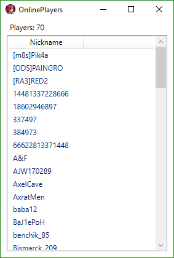

# Rather Weird
[CHANGELOG](./CHANGELOG.md) | [Red3.org Discussion](https://www.gamereplays.org/community/index.php?s=&showtopic=998432&view=findpost&p=10043767) | A stupid tool with a stupid name to manipulate RA3 in a good manner

## Features
* Automatically Press the ALT key (UP) if you move back to RA3 (Makes hotkeys usable)
* Start RA3 Windowed
* Remove Windows Border around game
* Lock mouse cursor in RA3 window
* Numpad Enter Hook (When pressing Enter on the numpad, simulate Enter on the main keyboard)
* Swap Healthbar logic (Healthbars can be shown automatically on start)
* Disable Windows Keys 

## Todo
* (Re-) Add borders around window to move it around

## Screenshots
### Main Application

### Player List
